# UpliftEvaluation_NRA

You can find the code used to 1- generate biased samples   2- Treatment group reweighting with the class transformation approach, the 2 Model approach, S-Learner

To execute the bias generation process with a dataset:

1- The treatment and output columns should be binary (0 and 1) and named respectively : 'segment' and 'visit'  
2- Datasets variables should be discretized  

You can launch the process with the following command on a Linux machine:

#### (For the bias generation process without domain adaptation for samples reweighting):  

*ipython BiasGenAndReweighting.py DatasetFileName UpliftMethod X NoDA VAR_Name*    

#### (For the bias generation process with the reweighting method "Ratio of gaussians"):  
*ipython BiasGenAndReweighting.py DatasetFileName UpliftMethod X rg VAR_Name* 

#### For the Uplift methods, you can use :   
1- KL [[2]](#2)  
2- CTS [[3]](#3)   
3- Chi [[2]](#2)  
4- ED [[2]](#2) 
5- 2M_LR (Two Model Approach with Logistic Regression)[[4]](#4)  
6- 2M_Xgboost (Two Model Approach with Xgboost) [[4]](#4) 
7- CT_Xgboost (Class Transformation Approach with Xgboost) [[5]](#5) 
8- CT_LR (Class Transformation with Logistic Regression) [[5]](#5) 
9- DR_LinR   Doubly Robust Learner with Linear regression
10- DR_Xgboost   Doubly Robust Learner with Xgboost
11- XLearner_LinR   XLearner with Linear regression
12- XLearner_Xgboost   XLearner with Xgboost
13- SLearner_LinR   SLearner with Linear regression
14- SLearner_Xgboost   SLearner with Xgboost

#### For the *VAR_Name* you can use the variable name as it appears in the data, or to use "Comb" in order to generate bias using all the variables in the dataset

## Datasets
In our study we used this code with the following datasets:

- *Hillstrom* [[6]](#6): Marketing dataset with 64.000 lines in total. It
contains two groups of treatments and a control group. The treatments are different marketing campaigns sent by mail, including advertisements of women's products (21.387 lines) or men's products (21.307 lines). The control group contains the individuals who did not receive a marketing campaign. A positive response is considered when the customer visits the website within two weeks after receiving the treatment (the e-mail).
In the experiments, we used the treatment of the women's products campaign and the control group.

- *Criteo* [[1]](#1): This database was created specifically for uplift prediction.
It contains 14 million individuals, where one group of individuals was targeted by an advertising campaign and another randomly selected group that was not targeted by the campaign. The treatment rate is 85%, and a visit from the customer marks a positive response.
A sample of 50.000 individuals was used.

- *Gerber* [[10]](#10): A database where we can study political behavior and the effect of social pressure to vote. Mailings were sent randomly to voters
to voters 11 days before an election in 2006. Voters who received
Neighbors' messages constitute the treatment group. In contrast, individuals who received the 'Civic Duty' message are the control group. Positive Response is considered when the voter votes.

- *Retail Hero* [[7]](#7): X5 sales group dataset that sends SMS messages to encourage people to buy more. The treatment group is the group of individuals who have been contacted by message, and the control group is the group that was not contacted.
A positive response is considered when the customer has made a purchase after being contacted.

- *Zenodo* [[8]](#8): a synthetic database containing trigonometric patterns specifically designed for uplift evaluation. We used a subset of 20,000 rows of data (data identified by the variable trial\_id = 1 and trial\_id = 2).

- *Megafon* [[9]](#9): Synthetic database was created specifically for uplift prediction. Telecom companies generated it in order to reproduce the situations encountered them.

- *Synth1* and *Synth2* : (Provided in the repo.) 2 synthetic datasets that we have built as a 2D grid of size 10x10 in which each cell corresponds to a particular uplift drawn at random.

# Results
## Following are the results of the benchmark that demonstrate the behavior of several uplift methods when facing NRA bias on the datasets cited above :

| {}                 | 2M\_Xgboost         | 2M_LR               | CT_Xgboost | CT_LR | DR_Xgboost         | DR_LinR              | XLearner_Xgboost            | XLearner_LinR        | SLearner_LinR  | SLearner_Xgboost   | KL                  | ED                  | CTS       |
|--------------------|---------------------|--------------------|-------------|---------------------|---------------------|---------------------|---------------------|---------------------|-----------|---------------------|---------------------|---------------------|-----------|
| Criteo\_f2         | 6.6(1.7)            | 7.2(1.6)           | 0.2(1.9)    | 1.9(1.2)            | 4.4(2.8)            | **9.9(0.9)**  | 5.5(2.6)            | 8.5(0.8)            | -0.2(1.9) | 8.0(1.9)            | 0.6(1.4)            | 4.9(1.3)            | 2.1(1.5)  |
| Criteo\_f2'        | 6.4(2.7)            | 10.1(1.4)          | 6.9(2.0)    | 7.6(1.4)            | 4.4(2.7)            | 10.3(1.6)           | 4.1(2.1)            | **11.1(1.0)** | -0.2(2.1) | 6.2(2.7)            | 10.3(1.2)           | 11.0(1.2)           | 10.5(1.3) |
| Criteo\_f8         | 8.1(2.6)            | 6.3(2.0)           | 0.1(1.7)    | 1.7(1.0)            | 3.7(2.3)            | **9.8(1.0)**  | 5.4(2.6)            | 8.1(1.1)            | -0.2(1.7) | 8.4(1.9)            | 1.2(1.6)            | 5.2(1.2)            | 2.4(1.6)  |
| Criteo\_f8'        | 7.2(2.6)            | 7.1(2.2)           | -2.5(1.7)   | -2.0(1.3)           | 3.4(3.0)            | **10.3(0.9)** | 5.3(2.0)            | 9.1(1.1)            | -0.4(1.9) | 6.9(2.1)            | -1.3(1.5)           | 4.5(1.6)            | 2.3(1.9)  |
| Gerber\_p2002      | -2.4(2.0)           | 1.1(1.1)           | -2.1(1.5)   | -0.4(1.2)           | -2.0(1.9)           | 0.8(1.1)            | -2.3(1.9)           | **1.4(1.1)**  | 0.1(0.9)  | -2.0(2.0)           | -1.5(1.8)           | -0.9(1.5)           | -0.1(1.7) |
| Gerber\_p2002'     | -2.4(1.9)           | 0.6(1.1)           | -1.5(2.2)   | **1.0(1.1)**  | -1.7(1.6)           | 0.8(1.2)            | -2.2(1.4)           | 0.7(1.0)            | -0.2(0.9) | -1.9(2.2)           | -0.8(1.6)           | -0.4(1.6)           | 0.1(1.6)  |
| Gerber\_p2004      | -2.1(2.0)           | 0.8(1.1)           | -1.8(1.7)   | -1.2(1.3)           | -2.1(1.9)           | 0.7(1.1)            | -2.1(1.8)           | **1.2(1.3)**  | 0.0(1.1)  | -1.8(2.0)           | -1.7(1.8)           | -1.5(1.9)           | -0.6(1.9) |
| Gerber\_p2004'     | -2.4(2.0)           | 1.0(1.3)           | -1.1(2.4)   | **1.4(1.4)**  | -2.1(1.7)           | 1.1(1.5)            | -2.0(1.7)           | 0.9(1.0)            | 0.1(1.1)  | -1.9(2.0)           | -1.3(1.3)           | -0.9(1.4)           | 0.0(1.5)  |
| Hillstrom\_mens    | 2.7(2.1)            | **5.5(2.6)** | -4.1(2.0)   | -4.6(2.2)           | 1.9(2.4)            | 5.4(2.1)            | 2.0(2.6)            | **5.5(2.2)**  | 0.2(2.4)  | 2.5(2.7)            | 2.8(2.6)            | 2.9(2.5)            | 1.0(2.8)  |
| Hillstrom\_mens'   | 2.7(2.5)            | 6.5(2.7)           | 4.6(1.5)    | **6.6(1.9)**  | 1.2(2.2)            | 5.9(2.4)            | 1.8(2.5)            | 5.8(1.8)            | 0.0(2.2)  | 2.9(2.9)            | 4.8(2.5)            | 4.9(2.1)            | 6.0(2.1)  |
| Hillstrom\_newbie  | 2.8(2.2)            | **6.2(2.7)** | 0.1(2.1)    | 2.4(1.9)            | 1.0(2.4)            | 5.9(2.0)            | 2.1(2.3)            | 6.0(2.0)            | -0.1(2.4) | 3.3(2.2)            | 4.2(2.2)            | 4.3(2.5)            | 4.3(2.5)  |
| Hillstrom\_newbie' | 3.6(2.6)            | 6.2(2.2)           | 1.7(2.1)    | 4.1(1.9)            | 1.8(2.7)            | 6.0(1.7)            | 2.9(2.8)            | **6.3(2.2)**  | 0.2(2.4)  | 2.5(2.7)            | 4.7(1.9)            | 4.8(2.0)            | 4.9(2.3)  |
| Megafone\_X16      | 17.8(0.5)           | 3.5(0.4)           | 8.6(0.6)    | 3.2(0.4)            | 16.9(0.5)           | 3.0(0.5)            | **18.3(0.4)** | 3.0(0.6)            | -0.0(0.6) | 17.9(0.4)           | 13.2(0.5)           | 13.7(0.5)           | 11.6(0.7) |
| Megafone\_X16'     | 18.0(0.4)           | 3.6(0.4)           | 14.2(0.5)   | 3.1(0.5)            | 17.3(0.5)           | 3.3(0.4)            | **18.4(0.5)** | 3.4(0.4)            | -0.1(0.5) | 18.2(0.5)           | 13.5(0.5)           | 13.7(0.5)           | 12.2(0.6) |
| Megafone\_X21      | 18.2(0.4)           | 3.5(0.4)           | 12.0(0.4)   | 2.4(0.5)            | 17.4(0.5)           | 3.0(0.4)            | **18.8(0.4)** | 3.1(0.4)            | -0.0(0.6) | 18.4(0.4)           | 13.9(0.5)           | 14.0(0.6)           | 10.7(0.8) |
| Megafone\_X21'     | 18.2(0.5)           | 3.3(0.6)           | 12.8(0.4)   | 1.8(0.6)            | 16.9(0.5)           | 2.7(0.6)            | **18.4(0.4)** | 2.9(0.5)            | 0.0(0.5)  | 18.3(0.4)           | 13.6(0.5)           | 13.9(0.5)           | 11.9(0.6) |
| Synth1             | 7.0(0.9)            | 0.9(1.6)           | 1.7(0.9)    | -2.9(1.3)           | 9.7(1.5)            | -0.4(1.5)           | **12.6(1.6)** | -1.6(2.0)           | 0.6(1.6)  | 12.2(1.2)           | 9.7(1.2)            | 8.8(1.6)            | 8.7(1.2)  |
| Synth1'            | 9.5(1.5)            | 2.1(0.7)           | -0.4(3.0)   | -0.8(2.8)           | **13.1(1.1)** | 0.3(1.9)            | 9.4(1.5)            | -0.8(1.0)           | -1.0(1.6) | 9.9(1.4)            | 12.0(1.9)           | 11.1(2.3)           | 10.4(1.8) |
| Synth2             | 9.8(0.1)            | 1.9(0.1)           | 8.1(0.5)    | 1.1(0.2)            | 9.7(0.2)            | 1.9(0.1)            | 9.7(0.2)            | 1.8(0.1)            | -0.1(0.4) | **10.1(0.1)** | 9.7(0.1)            | 9.6(0.2)            | 8.7(0.1)  |
| Synth2'            | **10.0(0.1)** | 1.7(0.0)           | 8.6(0.1)    | 1.4(0.4)            | 9.9(0.2)            | 1.7(0.1)            | 9.8(0.1)            | 1.7(0.1)            | 0.1(0.5)  | 9.9(0.2)            | 9.8(0.1)            | 9.5(0.2)            | 8.8(0.2)  |
| retailHero\_age    | 0.7(0.4)            | 1.2(0.3)           | 0.3(0.4)    | 0.8(0.4)            | 0.5(0.4)            | **1.3(0.4)**  | 0.5(0.3)            | 1.2(0.3)            | -0.0(0.3) | 0.9(0.3)            | 0.8(0.3)            | 0.9(0.3)            | 0.9(0.4)  |
| retailHero\_age'   | 0.7(0.5)            | 1.2(0.3)           | 0.6(0.4)    | **1.3(0.4)**  | 0.3(0.4)            | 1.2(0.4)            | 0.6(0.4)            | 1.2(0.4)            | -0.0(0.4) | 0.8(0.4)            | 0.9(0.4)            | 0.9(0.4)            | 0.6(0.5)  |
| retailHero\_trNum  | 0.8(0.4)            | 1.2(0.3)           | 0.4(0.3)    | 1.1(0.4)            | 0.4(0.4)            | **1.3(0.4)**  | 0.5(0.4)            | 1.2(0.4)            | -0.0(0.4) | 0.9(0.4)            | 0.7(0.4)            | 0.7(0.4)            | 0.6(0.4)  |
| retailHero\_trNum' | 0.8(0.4)            | **1.2(0.4)** | 0.5(0.4)    | 1.1(0.4)            | 0.4(0.3)            | **1.2(0.4)**  | 0.4(0.3)            | **1.2(0.3)**  | 0.0(0.3)  | 0.6(0.4)            | 0.6(0.4)            | 0.6(0.5)            | 0.3(0.4)  |
| zenodoSynth\_X10   | 9.7(1.8)            | 12.6(1.9)          | 7.0(2.2)    | 12.1(1.5)           | 7.8(1.9)            | 12.2(1.9)           | 9.4(1.7)            | 12.1(1.7)           | 0.0(2.5)  | 11.5(2.0)           | 12.8(1.9)           | **13.0(1.9)** | 10.6(2.6) |
| zenodoSynth\_X10'  | 9.5(2.1)            | 12.6(1.8)          | 6.9(2.1)    | 12.0(1.7)           | 8.0(2.2)            | 12.3(1.8)           | 8.8(2.4)            | 12.3(2.0)           | 0.1(2.2)  | 11.8(2.1)           | **13.5(2.4)** | **13.5(2.4)** | 10.7(2.5) |
| zenodoSynth\_X31   | 9.8(2.4)            | 12.2(2.0)          | 6.6(2.0)    | 12.0(1.9)           | 7.7(2.1)            | 12.3(1.9)           | 9.7(2.2)            | 12.4(1.7)           | 0.1(1.9)  | 11.7(2.2)           | 12.7(1.9)           | **13.2(2.0)** | 10.2(2.2) |
| zenodoSynth\_X31'  | 9.5(2.4)            | 12.2(1.8)          | 9.2(2.0)    | 11.8(1.5)           | 7.5(2.1)            | 12.4(1.9)           | 9.0(2.0)            | 12.4(1.8)           | 0.2(2.1)  | 11.1(2.1)           | 13.0(2.5)           | **13.4(2.3)** | 12.1(2.1) |

  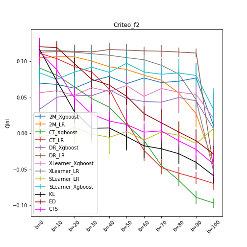
   
  
  

  
   
  

  
   
  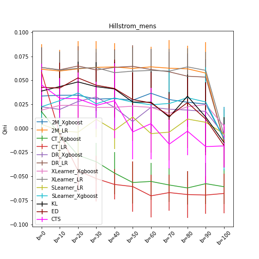

  
   
  

  
   
  

  
  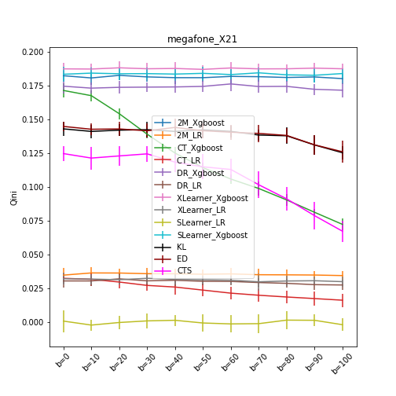 
  

  
   
  

  
   
  

  
   
  

## Following are the results of the treatment samples reweighting
*The reweighted methods are marked in green and orange while the method w/o reweighting in blue*

### Class Transformation with Xgboost

| {}                 | CT_Xgboost         | CT_Xgboost_wt1 | CT_Xgboost_wt2 |
|--------------------|---------------------|---------------------|----------------------------|
| Criteo\_f2         | 0.2(1.9)            | 2.6(1.8)            | **4.8(1.9)**        |
| Criteo\_f2'        | **6.9(2.0)**  | 5.1(1.7)            | 4.4(2.6)                   |
| Criteo\_f8         | 0.1(1.7)            | 3.4(1.5)            | **5.0(1.8)**         |
| Criteo\_f8'        | -2.5(1.7)           | 1.7(2.2)            | **2.5(2.5)**         |
| Gerber\_p2002      | -2.1(1.5)           | **-1.6(1.9)** | -2.3(1.8)                  |
| Gerber\_p2002'     | **-1.5(2.2)** | -1.6(2.0)           | -2.1(1.8)                  |
| Gerber\_p2004      | -1.8(1.7)           | **-1.7(1.8)** | -2.3(1.9)                  |
| Gerber\_p2004'     | **-1.1(2.4)** | -1.7(2.0)           | -2.1(2.1)                  |
| Hillstrom\_mens    | -4.1(2.0)           | -0.2(2.7)           | **0.5(2.4)**         |
| Hillstrom\_mens'   | **4.6(1.5)**  | 1.8(2.1)            | 2.9(2.1)                   |
| Hillstrom\_newbie  | 0.1(2.1)            | 1.3(2.0)            | **1.4(2.1)**         |
| Hillstrom\_newbie' | 1.7(2.1)            | 1.5(2.2)            | **3.0(2.4)**         |
| Megafone\_X16      | 8.6(0.6)            | 8.4(0.5)            | **15.5(0.5)**        |
| Megafone\_X16'     | 14.2(0.5)           | 14.3(0.4)           | **16.5(0.5)**        |
| Megafone\_X21      | 12.0(0.4)           | 12.0(0.4)           | **16.0(0.5)**        |
| Megafone\_X21'     | 12.8(0.4)           | 12.7(0.4)           | **16.1(0.5)**        |
| Synth1             | 1.7(0.9)            | 2.5(0.7)            | **8.9(2.9)**         |
| Synth1'            | -0.4(3.0)           | 0.8(2.7)            | **9.1(1.7)**         |
| Synth2             | 8.1(0.5)            | 8.3(0.5)            | **9.7(0.2)**         |
| Synth2'            | 8.6(0.1)            | 8.4(0.3)            | **9.7(0.1)**         |
| retailHero\_age    | 0.3(0.4)            | 0.3(0.4)            | **0.6(0.4)**         |
| retailHero\_age'   | 0.6(0.4)            | **0.7(0.4)**  | 0.6(0.4)                   |
| retailHero\_trNum  | 0.4(0.3)            | 0.4(0.3)            | **0.6(0.3)**         |
| retailHero\_trNum' | 0.5(0.4)            | **0.6(0.4)**  | 0.5(0.4)                   |
| zenodoSynth\_X10   | 7.0(2.2)            | **7.4(2.0)**  | 6.5(2.1)                   |
| zenodoSynth\_X10'  | 6.9(2.1)            | **7.3(2.1)**  | 6.6(1.8)                   |
| zenodoSynth\_X31   | 6.6(2.0)            | **7.2(2.5)** | 6.5(2.2)                   |
| zenodoSynth\_X31'  | **9.2(2.0)**  | 7.9(2.3)            | 7.4(2.1)                   |

  
   
  
  

  
   
  

  
   
  

  
   
  

  
   
  

  
   
  

  
   
  

  
   
  

  
   
  

### Class Transformation with LR

| {}                 | CT_LR              | CT_LR_wt1      | CT_LR_wt2 |
|--------------------|---------------------|---------------------|-----------------------|
| Criteo\_f2         | 1.9(1.2)            | 6.1(1.5)            | **8.2(2.0)**    |
| Criteo\_f2'        | 7.6(1.4)            | **7.7(2.9)**  | 7.2(2.1)              |
| Criteo\_f8         | 1.7(1.0)            | 5.5(1.8)            | **7.9(1.7)    |
| Criteo\_f8'        | -2.0(1.3)           | 6.1(1.4)            | **7.3(2.0)**    |
| Gerber\_p2002      | -0.4(1.2)           | **0.9(1.1)**  | 0.5(1.2)              |
| Gerber\_p2002'     | 1.0(1.1)            | **1.2(1.2)  | 0.6(1.3)              |
| Gerber\_p2004      | -1.2(1.3)           | **0.9(1.3)**  | 0.4(1.1)              |
| Gerber\_p2004'     | **1.4(1.4)**  | 0.7(1.1)            | 0.7(1.2)              |
| Hillstrom\_mens    | -4.6(2.2)           | **5.3(2.2)**  | 4.2(2.2)              |
| Hillstrom\_mens'   | **6.6(1.9)**  | 5.9(2.3)            | 6.3(1.9)              |
| Hillstrom\_newbie  | 2.4(1.9)            | **5.6(2.0)**  | 5.2(2.1)              |
| Hillstrom\_newbie' | 4.1(1.9)            | **6.0(1.9)**  | 5.8(2.4)              |
| Megafone\_X16      | **3.2(0.4)**  | 3.1(0.4)            | **3.2(0.4)**    |
| Megafone\_X16'     | 3.1(0.5)            | **3.4(0.3)**  | 3.1(0.4)              |
| Megafone\_X21      | 2.4(0.5)            | **3.1(0.4)**  | 3.0(0.5)              |
| Megafone\_X21'     | 1.8(0.6)            | 2.5(0.5)            | **2.9(0.5)**    |
| Synth1             | -2.9(1.3)           | -1.0(1.8)           | **-0.8(0.9)**   |
| Synth1'            | -0.8(2.8)           | **-0.7(1.9)** | -1.3(2.0)             |
| Synth2             | 1.1(0.2)            | **1.9(0.1)**  | 1.7(0.1)              |
| Synth2'            | 1.4(0.4)            | 1.6(0.3)            | **1.8(0.1)**    |
| retailHero\_age    | 0.8(0.4)            | **1.3(0.4)**  | 1.2(0.3)              |
| retailHero\_age'   | **1.3(0.4)**  | 1.2(0.4)            | 1.2(0.4)              |
| retailHero\_trNum  | 1.1(0.4)            | **1.2(0.4)**  | **1.2(0.4)**    |
| retailHero\_trNum' | 1.1(0.4)            | 1.1(0.3)            | **1.2(0.4)**    |
| zenodoSynth\_X10   | **12.1(1.5)** | 11.9(1.7)           | 9.8(1.8)              |
| zenodoSynth\_X10'  | **12.0(1.7)** | 11.6(1.9)           | 9.9(2.0)              |
| zenodoSynth\_X31   | 12.0(1.9)           | **12.1(1.7) **| 9.9(2.0)              |
| zenodoSynth\_X31'  | 11.8(1.5)           | **12.1(1.8)** | 11.1(1.6)             |

  
   
  
  

  
   
  

  
   
  

  
   
  

  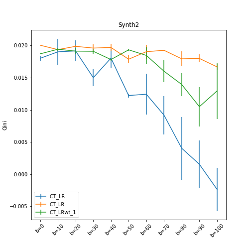
   
  

  
   
  

  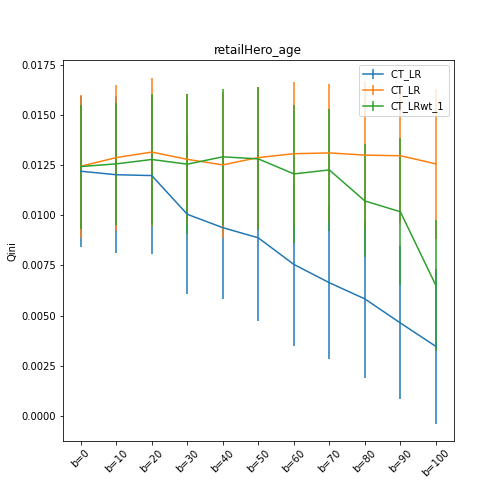
   
  

  
   
  

  
   
  

# 2 Model approach with Xgboost

| {}                 | 2M_Xgboost         | 2M_Xgboost_wt1 | 2M_Xgboost_wt2 |
|--------------------|---------------------|---------------------|----------------------------|
| Criteo\_f2         | 6.6(1.7)            | **7.9(2.6)**  | 7.7(1.7)                   |
| Criteo\_f2'        | 6.4(2.7)            | 6.9(2.2)            | **7.3(2.7)**         |
| Criteo\_f8         | **8.1(2.6)**  | 7.3(1.7)            | 6.8(1.8)                   |
| Criteo\_f8'        | **7.2(2.6)**  | **7.2(2.2)**  | 6.5(2.2)                   |
| Gerber\_p2002      | -2.4(2.0)           | -2.1(1.9)           | **-1.8(2.0)**        |
| Gerber\_p2002'     | -2.4(1.9)           | -2.7(1.8)           | **-2.3(2.5)**        |
| Gerber\_p2004      | **-2.1(2.0)** | -2.3(2.1)           | -2.5(2.3)                  |
| Gerber\_p2004'     | **-2.4(2.0)** | -2.7(1.5)           | -2.6(1.8)                  |
| Hillstrom\_mens    | 2.7(2.1)            | 2.6(2.5)            | **3.5(2.0)**         |
| Hillstrom\_mens'   | 2.7(2.5)            | **3.3(2.8)**  | 2.6(2.5)                   |
| Hillstrom\_newbie  | 2.8(2.2)            | **3.5(1.9)**  | 3.1(2.6)                   |
| Hillstrom\_newbie' | **3.6(2.6)**  | 3.1(2.7)            | 3.2(2.2)                   |
| Megafone\_X16      | 17.8(0.5)           | **17.9(0.4)** | 17.6(0.4)                  |
| Megafone\_X16'     | **18.0(0.4)** | **18.0(0.5)** | 17.7(0.5)                  |
| Megafone\_X21      | **18.2(0.4)** | **18.2(0.6)** | 18.0(0.5)                  |
| Megafone\_X21'     | **18.2(0.5)** | 18.1(0.5)           | 17.9(0.4)                  |
| Synth1             | 7.0(0.9)            | **10.9(0.7)** | 10.8(3.4)                  |
| Synth1'            | 9.5(1.5)            | 9.8(0.9)            | **10.1(1.6)**        |
| Synth2             | 9.8(0.1)            | 9.8(0.1)            | **9.9(0.1)**         |
| Synth2'            | 10.0(0.1)           | **10.1(0.1)** | 9.9(0.1)                   |
| retailHero\_age    | **0.7(0.4)**  | **0.7(0.3)**  | **0.7(0.4)         |
| retailHero\_age'   | **0.7(0.5)**  | **0.7(0.4)**  | 0.6(0.4)                   |
| retailHero\_trNum  | **0.8(0.4)**  | **0.8(0.4)**  | 0.7(0.3)                   |
| retailHero\_trNum' | **0.8(0.4)**  | 0.7(0.4)            | **0.8(0.4)**         |
| zenodoSynth\_X10   | 9.7(1.8)            | 9.8(2.4)            | **10.5(2.3)**        |
| zenodoSynth\_X10'  | 9.5(2.1)            | 9.7(2.8)            | **10.3(1.9)**        |
| zenodoSynth\_X31   | 9.8(2.4)            | **10.3(2.0)** | 9.1(2.4)                   |
| zenodoSynth\_X31'  | **9.5(2.4)**  | 8.9(2.1)            | **9.5(1.9**)         |

  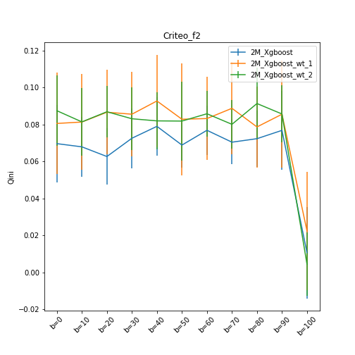
   
  
  

  
   
  

  
   
  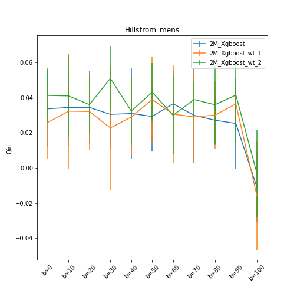

  
  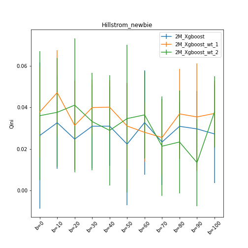 
  

  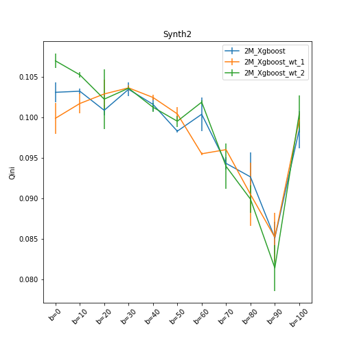
   
  

  
  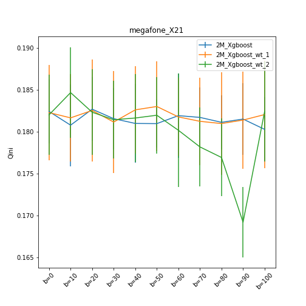 
  

  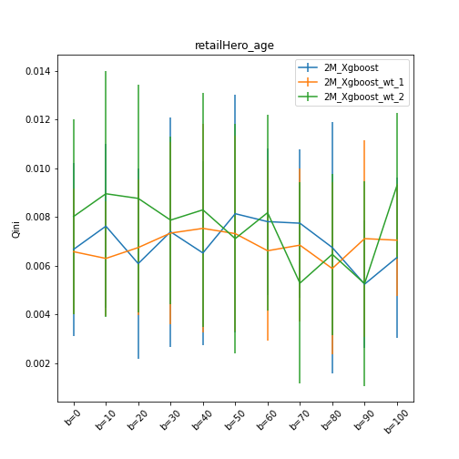
   
  

  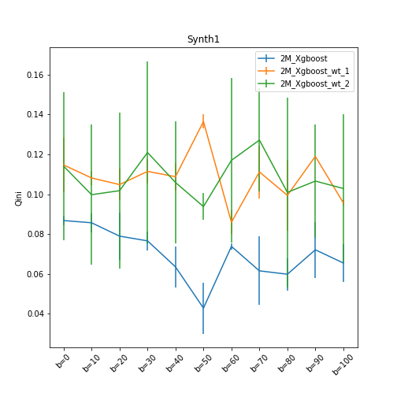
   
  

  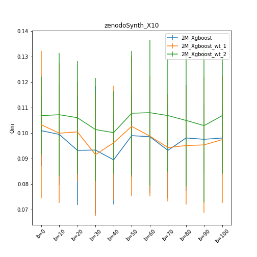
   
  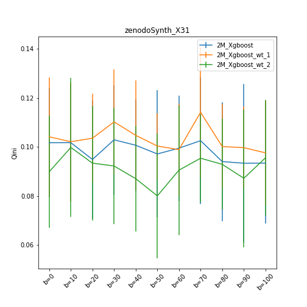

# 2 model approach with Logistic regression

| {}                 | 2MLR                | 2MLR_trtProb        | 2MLR_trtProbXgboost |
|--------------------|---------------------|---------------------|---------------------|
| Criteo\_f2         | 7.2(1.6)            | **9.3(1.5)**  | 9.0(2.0)            |
| Criteo\_f2'        | 10.1(1.4)           | 9.7(1.4)            | **10.4(1.8)** |
| Criteo\_f8         | 6.3(2.0)            | **9.7(1.3)**  | 8.6(1.7)            |
| Criteo\_f8'        | 7.1(2.2)            | **9.5(1.4)**  | 9.0(1.8)            |
| Gerber\_p2002      | **1.1(1.1)**  | 1.0(1.2)            | 1.0(1.0)            |
| Gerber\_p2002'     | 0.6(1.1)            | **0.9(1.3)**  | 0.7(1.2)            |
| Gerber\_p2004      | 0.8(1.1)            | **0.9(1.0)**  | 0.7(1.3)            |
| Gerber\_p2004'     | **1.0(1.3)**  | 0.9(1.3)            | 0.8(1.2)            |
| Hillstrom\_mens    | **5.5(2.6)**  | 5.3(2.7)            | **5.5(2.7)**  |
| Hillstrom\_mens'   | **6.5(2.7)**  | 6.1(2.5)            | 6.2(1.9)            |
| Hillstrom\_newbie  | 6.2(2.7)            | 5.8(2.0)            | **6.3(2.4)**  |
| Hillstrom\_newbie' | **6.2(2.2)**  | **6.2(2.4)**  | 5.9(2.6)            |
| Megafone\_X16      | 3.5(0.4)            | 3.5(0.4)            | **3.6(0.4)**  |
| Megafone\_X16'     | 3.6(0.4)            | **3.7(0.4)**  | 3.5(0.4)            |
| Megafone\_X21      | **3.5(0.4)**  | 3.4(0.4)            | **3.5(0.4)**  |
| Megafone\_X21'     | 3.3(0.6)            | 3.2(0.6)            | **3.4(0.5)**  |
| Synth1             | 0.9(1.6)            | **1.2(0.7)**  | 0.9(2.1)            |
| Synth1'            | **2.1(0.7)**  | -0.3(0.8)           | 1.0(1.6)            |
| Synth2             | **1.9(0.1)**  | **1.9(0.1)**  | 1.7(0.1)            |
| Synth2'            | 1.7(0.0)            | 1.7(0.2)            | **1.9(0.1)**  |
| retailHero\_age    | **1.2(0.3)**  | **1.2(0.4)**  | **1.2(0.3)**  |
| retailHero\_age'   | **1.2(0.3)**  | **1.2(0.3)**  | **1.2(0.3)**  |
| retailHero\_trNum  | **1.2(0.3)**  | **1.2(0.4)**  | **1.2(0.3)**  |
| retailHero\_trNum' | 1.2(0.4)            | **1.3(0.3)**  | 1.2(0.3)            |
| zenodoSynth\_X10   | **12.6(1.9)** | 12.3(2.0)           | 12.1(1.8)           |
| zenodoSynth\_X10'  | **12.6(1.8)** | 12.3(1.5)           | 12.4(1.7)           |
| zenodoSynth\_X31   | 12.2(2.0)           | **12.5(1.7)** | 12.0(2.0)           |
| zenodoSynth\_X31'  | 12.2(1.8)           | 12.2(1.8)           | **12.6(1.8)** |

  
   
  

  
   
  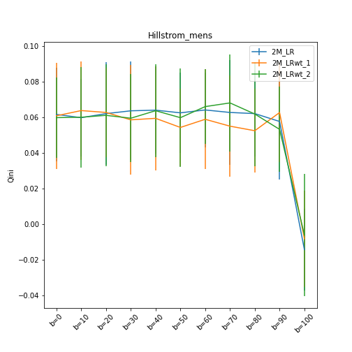

  
   
  

  
   
  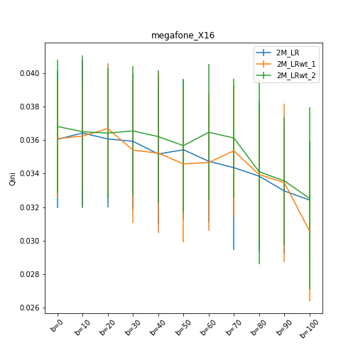

  
  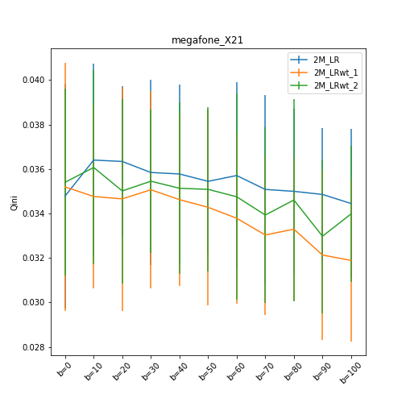 
  

  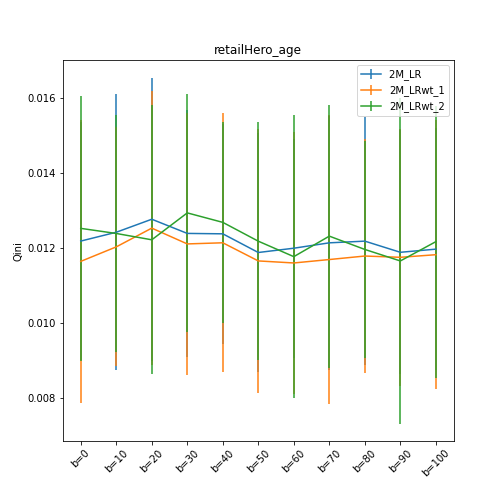
   
  

  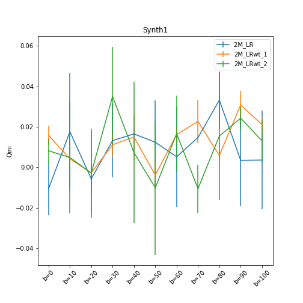
   
  

  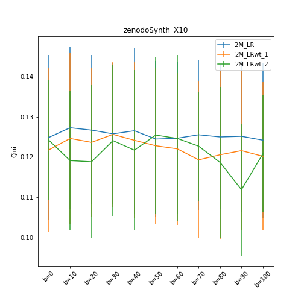
   
  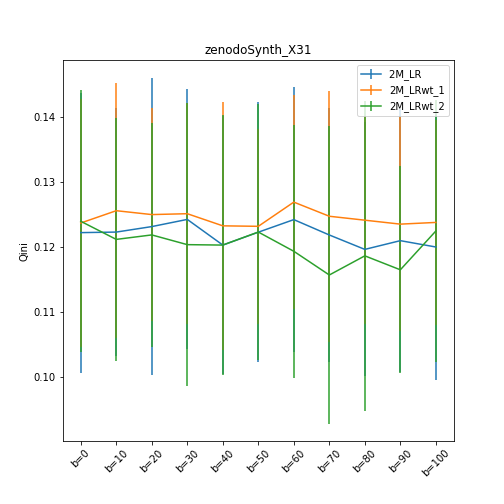

# Slearner with Logistic Regression

| {}                                                 | SLearner_LinR            | SLearner_LR_wt1    | SLearner_LR_wt2 |
|----------------------------------------------------|---------------------|---------------------|-------------------------|
| SyntheticData\_zenodo\_20Kprimex10\_informative    | **0.1(2.2)**  | -0.1(2.1)           | -0.1(2.1)               |
| SyntheticData\_zenodo\_20Kprimex31\_uplift\_inc... | **0.2(2.1)**  | 0.1(2.3)            | 0.1(2.0)                |
| SyntheticData\_zenodo\_20Kx10\_informative         | **0.0(2.5)**  | -0.1(2.2)           | **-0.0(2.1)**     |
| SyntheticData\_zenodo\_20Kx31\_uplift\_increase    | **0.1(1.9)**  | **0.1(2.1)**  | **0.1(1.9)**      |
| criteoNewSample50kIdPf2                            | -0.2(1.9)           | **-0.1(2.2)** | **-0.1(2.6)**     |
| criteoNewSample50kIdPf8                            | -0.2(1.7)           | **-0.1(2.1)** | -0.3(2.5)               |
| criteoNewSample50kprimeIdPf2                       | **-0.2(2.1)** | **-0.2(2.4)** | -0.6(2.3)               |
| criteoNewSample50kprimeIdPf8                       | -0.4(1.9)           | **-0.0(2.4**) | -0.1(2.4)               |
| gerber\_Khiops\_NvsCDIdPp2002                      | 0.1(0.9)            | **0.2(1.0)**  | -0.1(1.0)               |
| gerber\_Khiops\_NvsCDIdPp2004                      | **0.0(1.1)**  | **0.0(1.0)**  | **0.0(1.0)**      |
| gerber\_Khiops\_NvsCDprimeIdPp2002                 | -0.2(0.9)           | **-0.0(0.9)** | -0.1(1.0)               |
| gerber\_Khiops\_NvsCDprimeIdPp2004                 | **0.1(1.1)**  | -0.2(1.0)           | -0.1(1.1)               |
| hillstrom\_w\_Discmens                             | **0.2(2.4)**  | -0.1(2.1)           | 0.1(2.2)                |
| hillstrom\_w\_Discnewbie                           | -0.1(2.4)           | **0.3(2.3)**  | -0.4(2.3)               |
| hillstrom\_w\_Discprimemens                        | 0.0(2.2)            | 0.0(2.2)            | **0.1(2.1)**      |
| hillstrom\_w\_Discprimenewbie                      | **0.2(2.4)**  | -0.2(2.5)           | 0.0(2.3)                |
| megafoneIdPX\_16                                   | -0.0(0.6)           | **0.1(0.7)**  | 0.0(0.5)                |
| megafoneIdPX\_21                                   | **-0.0(0.6)** | **0.0(0.5)**  | **0.0(0.5)**      |
| megafoneprimeIdPX\_16                              | -0.1(0.5)           | **0.1(0.5)**  | 0.0(0.5)                |
| megafoneprimeIdPX\_21                              | **0.0(0.5)**  | **0.0(0.5)**  | **0.0(0.5)**      |
| retailHeroPreProcessedMinaDiscage                  | **-0.0(0.3)** | -0.1(0.4)           | -0.1(0.3)               |
| retailHeroPreProcessedMinaDiscprimeage             | **-0.0(0.4)** | **0.0(0.3)**  | **-0.0(0.3)**     |
| retailHeroPreProcessedMinaDiscprimetransactionN... | **0.0(0.3)  | **-0.0(0.4)** | **-0.0(0.4)**     |
| retailHeroPreProcessedMinaDisctransactionNumber    | **-0.0(0.4)** | **0.0(0.4)**  | **0.0(0.3)**      |
| syntheticDataRandomMinaUnequalY\_NOISEComb2        | -0.1(0.4)           | **-0.0(0.4)** | **0.0(0.4)**      |
| syntheticDataRandomMinaUnequalY\_NOISEprimeComb2   | **0.1(0.5)**  | -0.2(0.4)           | 0.0(0.3)                |
| verysmallRateYNoisyv2Comb2                         | 0.6(1.6)            | 0.4(1.3)            | **0.8(1.4)**      |
| verysmallRateYNoisyv2primeComb2                    | -1.0(1.6)           | **0.8(1.1)**  | 0.5(1.8)                |

  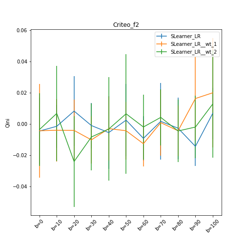
   
  
  

  
   
  

  
   
  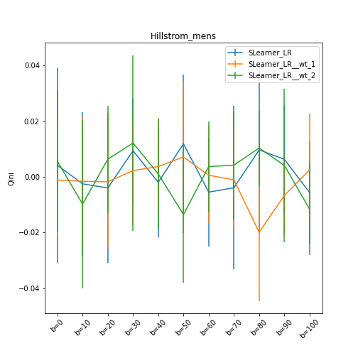

  
  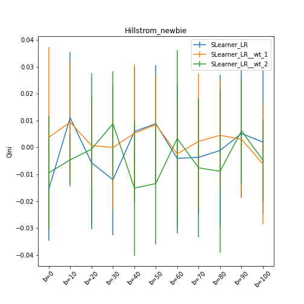 
  

  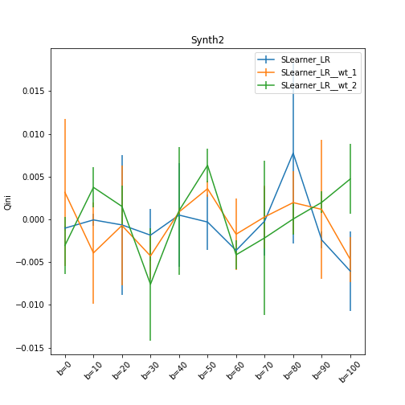
   
  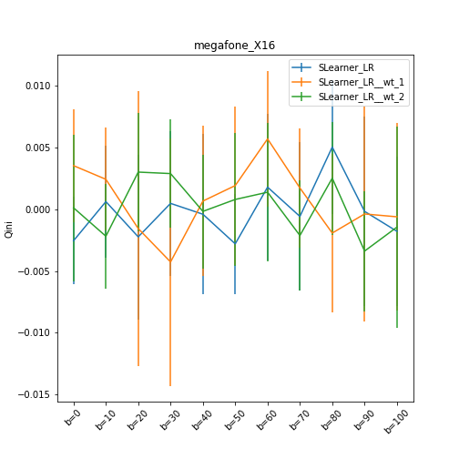

  
  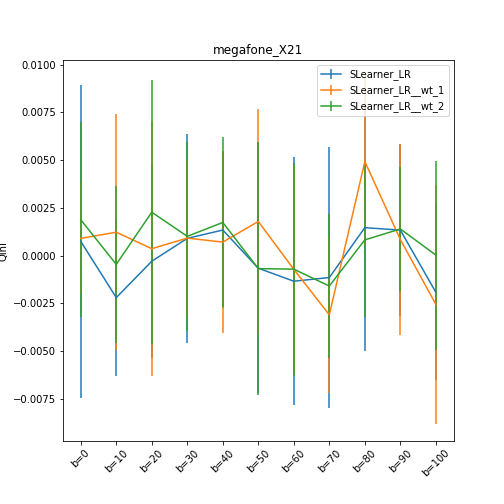 
  

  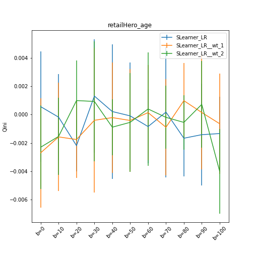
   
  

  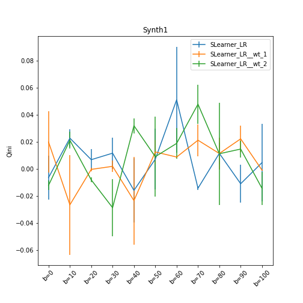
   
  

  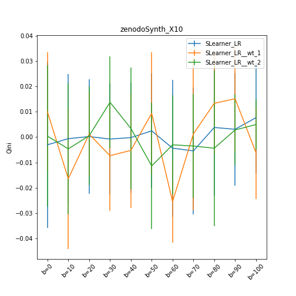
   
  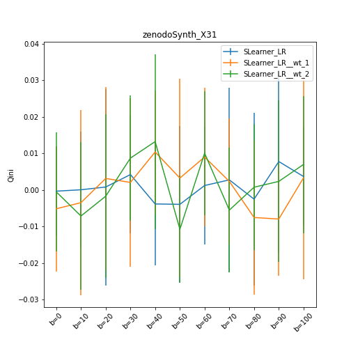

# Slearner with Xgboost

| {}                                                 | SLearner_Xgboost   | SLearner_Xgboost_wt1 | SLearner_Xgboost_wt2 |
|----------------------------------------------------|---------------------|---------------------------|----------------------------------|
| SyntheticData\_zenodo\_20Kprimex10\_informative    | **11.8(2.1)** | 11.4(2.4)                 | 11.3(2.1)                        |
| SyntheticData\_zenodo\_20Kprimex31\_uplift\_inc... | **11.1(2.1)** | 10.8(2.1)                 | 11.0(2.4)                        |
| SyntheticData\_zenodo\_20Kx10\_informative         | **11.5(2.0)** | 11.4(2.4)                 | 11.1(2.2)                        |
| SyntheticData\_zenodo\_20Kx31\_uplift\_increase    | **11.7(2.2)** | 10.9(1.8)                 | 11.1(2.1)                        |
| criteoNewSample50kIdPf2                            | 8.0(1.9)            | 7.5(2.1)                  | **8.6(2.5)**               |
| criteoNewSample50kIdPf8                            | **8.4(1.9)**  | **8.4(2.0)**        | **8.4(2.1)**               |
| criteoNewSample50kprimeIdPf2                       | 6.2(2.7)            | **6.8(1.8)**        | 6.5(2.8)                         |
| criteoNewSample50kprimeIdPf8                       | 6.9(2.1)            | **7.5(2.9)**        | 7.3(2.0)                         |
| gerber\_Khiops\_NvsCDIdPp2002                      | -2.0(2.0)           | **-1.9(2.0)**       | -2.1(1.9)                        |
| gerber\_Khiops\_NvsCDIdPp2004                      | -1.8(2.0)           | **-1.7(2.1)**       | -2.2(1.8)                        |
| gerber\_Khiops\_NvsCDprimeIdPp2002                 | -1.9(2.2)           | -2.1(1.9)                 | **-1.7(1.7)**             |
| gerber\_Khiops\_NvsCDprimeIdPp2004                 | -1.9(2.0)           | **-1.8(2.0)**       | **-1.8(2.3)**              |
| hillstrom\_w\_Discmens                             | 2.5(2.7)            | 3.0(2.3)                  | **3.1(2.5)**               |
| hillstrom\_w\_Discnewbie                           | **3.3(2.2)**  | 3.0(2.4)                  | 2.3(2.0)                         |
| hillstrom\_w\_Discprimemens                        | **2.9(2.9)**  | 2.7(2.6)                  | 2.3(2.4)                         |
| hillstrom\_w\_Discprimenewbie                      | 2.5(2.7)            | 2.6(2.5)                  | **3.7(2.4)**               |
| megafoneIdPX\_16                                   | **17.9(0.4)** | **17.9(0.4)**       | 17.8(0.5)                        |
| megafoneIdPX\_21                                   | 18.4(0.4)           | **18.5(0.4)**       | 18.2(0.5)                        |
| megafoneprimeIdPX\_16                              | **18.2(0.5)** | **18.2(0.5)**       | 17.9(0.5)                        |
| megafoneprimeIdPX\_21                              | **18.3(0.4)** | **18.3(0.4)**       | 18.0(0.5)                        |
| retailHeroPreProcessedMinaDiscage                  | **0.9(0.3)**  | 0.8(0.4)                  | 0.7(0.4)                         |
| retailHeroPreProcessedMinaDiscprimeage             | **0.8(0.4)**  | **0.8(0.4)**        | 0.7(0.4)                         |
| retailHeroPreProcessedMinaDiscprimetransactionN... | 0.6(0.4)            | **0.7(0.4)**        | **0.7(0.4)**               |
| retailHeroPreProcessedMinaDisctransactionNumber    | **0.9(0.4)**  | **0.9(0.3)**        | **0.9(0.4)**               |
| syntheticDataRandomMinaUnequalY\_NOISEComb2        | **10.1(0.1)** | 9.9(0.1)                  | 9.8(0.1)                         |
| syntheticDataRandomMinaUnequalY\_NOISEprimeComb2   | 9.9(0.2)            | 9.9(0.2)                  | **10.0(0.2)**              |
| verysmallRateYNoisyv2Comb2                         | **12.2(1.2)** | 11.8(1.4)                 | 10.0(1.2)                        |
| verysmallRateYNoisyv2primeComb2                    | 9.9(1.4)            | 10.8(1.3)                 | **11.6(1.2)**              |

  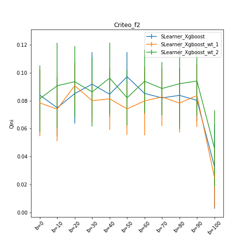
   
  
  

  
   
  

  
   
  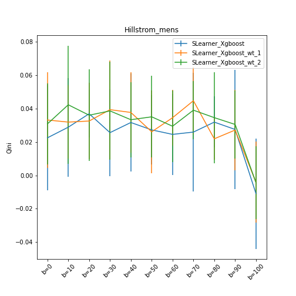

  
  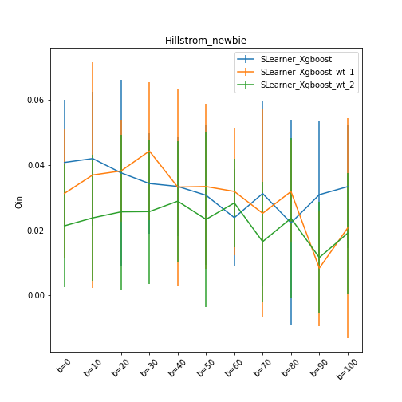 
  

  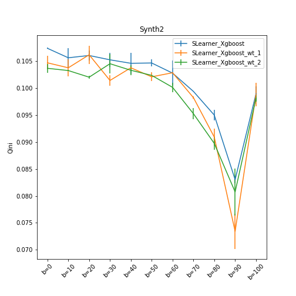
   
  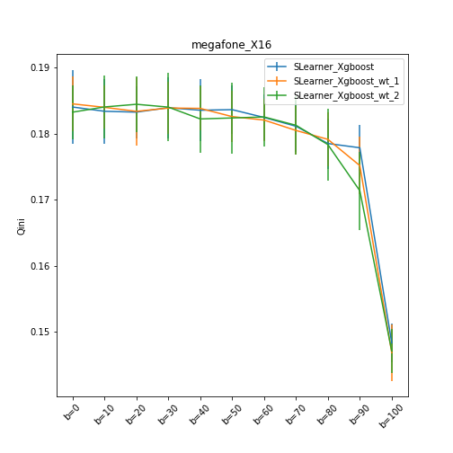

  
  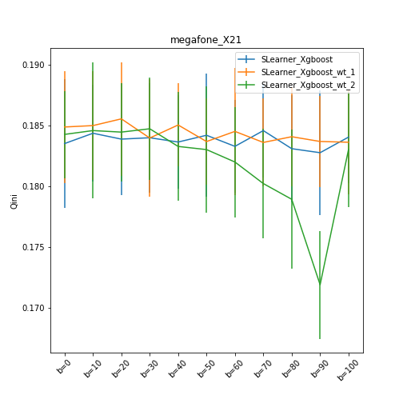 
  

  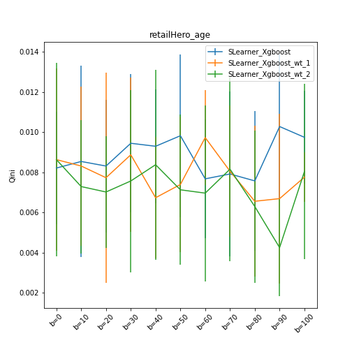
   
  

  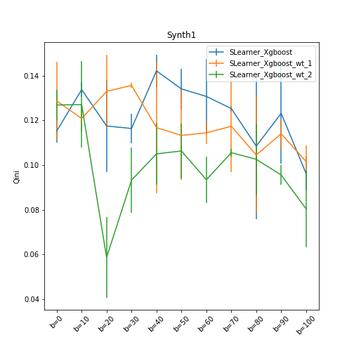
   
  

  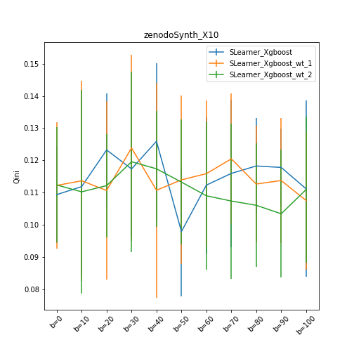
   
  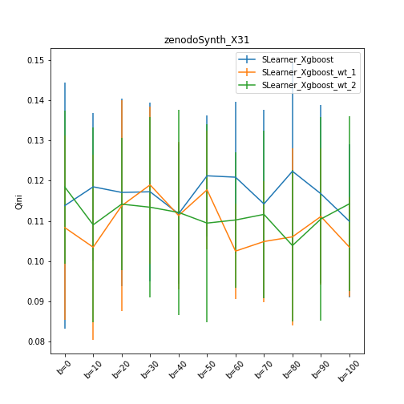

